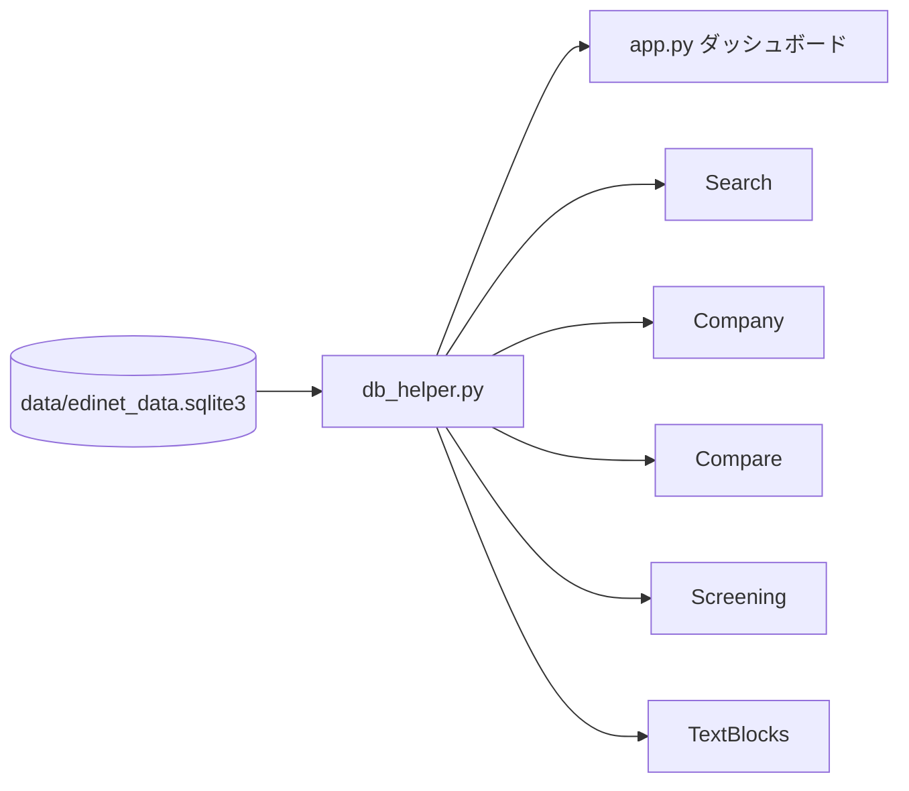

# edinet-viewer

EDINET（金融庁 電子開示システム）から抽出・蓄積した有価証券報告書などの財務データ・テキストブロックを、Streamlitのマルチページアプリで閲覧・検索・比較するビューアです。

このリポジトリは**表示専用**です。EDINETからの書類取得・XBRL解析・DB生成の処理は含まれません。成果物のSQLite（`data/edinet_data.sqlite3`）を読み取り、ブラウザで参照します。

## 公開先・起動

- リポジトリ: https://github.com/onokazu777/edinet-viewer
- ローカルViewer: http://localhost:8502（`run.bat`の既定ポート）

Streamlitクラウド等への公開URLは、このリポジトリ内に未記録です。

## 処理の概要



ホーム画面でDB統計と最近の提出書類を表示し、各ページから企業検索、財務詳細・チャート、複数社比較、指標スクリーニング、テキストブロック検索を行います。

## 主な構成

- `app.py`  
  ダッシュボード（統計、書類種別内訳、最近の提出書類）とサイドバーのクイック検索。
- `pages/`  
  企業検索・企業詳細・比較・スクリーニング・テキスト閲覧の各ページ。
- `db_helper.py`  
  SQLite読み取りと`@st.cache_data`によるキャッシュ。
- `data/edinet_data.sqlite3`  
  表示用データベース（リポジトリに同梱）。
- `run.bat`  
  ローカルでStreamlitを起動します。
- `push.bat`  
  `git add` / `commit` / `push` の補助バッチ（コミットメッセージはバッチ内に固定）。

## 詳細ドキュメント

- [システム構成](docs/system-architecture.md)
- [データフローとファイル一覧](docs/data-flow.md)
- [プログラム一覧](docs/programs.md)
- [運用・障害対応](docs/operations.md)

## ローカル環境

```powershell
pip install -r requirements.txt
```

起動:

```powershell
.\run.bat
```

または:

```powershell
python -m streamlit run app.py --server.port 8502
```

ブラウザで http://localhost:8502 を開きます。

## データについて

- 出典: [EDINET](https://disclosure2.edinet-fsa.go.jp/)（金融庁 電子開示システム）
- 格納先: `data/edinet_data.sqlite3`
- アプリはDBを読み取り専用で開きます。取得・更新パイプラインはこのリポジトリ外です。

## 機密情報

表示アプリ本体にAPIキーやパスワードは不要です。DBファイル自体に機密を含めない運用を前提とします。
