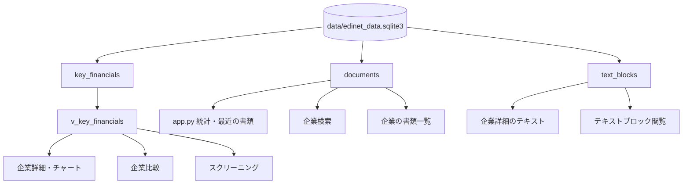

# データフローとファイル一覧

## 閲覧時の流れ



アプリはSQLiteを読むだけです。EDINETへのHTTP取得やXBRL ZIPの展開は行いません。

## データベース構造

ファイル:

```text
data/edinet_data.sqlite3
```

### `documents`

書類メタデータ。

| 列 | 内容 |
|---|---|
| `doc_id` | 書類ID |
| `edinet_code` | EDINETコード |
| `sec_code` | 証券コード |
| `jcn` | 法人番号 |
| `filer_name` | 提出者名 |
| `doc_type_code` | 書類種別コード |
| `doc_description` | 概要 |
| `period_start` / `period_end` | 対象期間 |
| `submit_date` / `file_date` | 提出日・ファイル日付 |
| `xbrl_flag` / `pdf_flag` | XBRL/PDF有無フラグ |
| `parse_status` | 解析状態 |

インデックス: `sec_code`、`doc_type_code`、`file_date`、`period_end`。

書類種別（`db_helper.DOC_TYPE_NAMES`）:

| コード | 名称 |
|---|---|
| 120 | 有価証券報告書 |
| 130 | 訂正有価証券報告書 |
| 140 | 四半期報告書 |
| 150 | 訂正四半期報告書 |
| 160 | 半期報告書 |
| 170 | 訂正半期報告書 |
| 060 | 大量保有報告書 |
| 070 | 訂正大量保有報告書 |

現行同梱DBの種別件数は、主に160・120・130・150・170です（060/070/140はコード上は定義のみの場合があります）。

### `key_financials`

企業×期末×連結/単体の主要財務指標。

| 列 | 内容 |
|---|---|
| `sec_code` / `filer_name` | 企業 |
| `period_end` | 期末 |
| `is_consolidated` | 1=連結、0=単体 |
| `doc_type_code` | 書類種別 |
| `sales` ほか金額列 | 売上高、営業・経常・純利益、総資産、純資産、営業/投資/財務CF |
| `eps` / `equity_ratio` / `roe` | 指標（UIの主要表示は金額列中心） |

金額は円単位で保持し、画面表示時に億円へ換算します。

### `v_key_financials`

```sql
CREATE VIEW v_key_financials AS SELECT * FROM key_financials
```

企業詳細・比較・スクリーニングはすべてこのビュー（実質`key_financials`）を参照します。

### `text_blocks`

開示テキスト。

| 列 | 内容 |
|---|---|
| `doc_id` | 書類ID |
| `sec_code` / `filer_name` | 企業 |
| `period_start` / `period_end` | 対象期間 |
| `element_name` | XBRL要素名 |
| `section_label` | 日本語セクション名 |
| `context` | コンテキスト |
| `text_content` | 本文 |

現行データに多いセクション例:

- 経営者による財政状態、経営成績及びキャッシュ・フローの状況の分析（MD&A）
- 事業の内容
- 事業等のリスク
- 研究開発活動
- 配当政策

### `financials`（任意・現行DBには無し）

`get_financial_details()`が勘定科目レベルの詳細を取るためのテーブルです。存在しない場合、詳細取得は空結果になり、主要指標（`key_financials`）中心のUIで動作します。

## 画面別の入出力

| 画面 | 主な入力 | 出力 |
|---|---|---|
| ホーム | `documents`集計、`key_financials`/`text_blocks`件数 | メトリクス、棒グラフ、最近30件の書類表 |
| 企業検索 | `documents`の`sec_code`/`filer_name` | 企業リスト、Company/TextBlocksへのリンク |
| 企業詳細 | `v_key_financials`、`text_blocks`、`documents` | 財務表、CSV、Plotly、テキスト、書類一覧 |
| 企業比較 | `v_key_financials`（最大5社） | 最新期比較表、推移線、レーダーチャート |
| スクリーニング | 各社の最新連結期（`is_consolidated=1`） | 条件一致企業表、`screening_result.csv` |
| テキスト閲覧 | `text_blocks`（コード・セクション・キーワード） | 本文表示、個別txt、一括CSV |

## スクリーニングの計算

ページ側で算出します（DB列の再定義ではありません）。

- 自己資本比率（%）= `net_assets / total_assets * 100`
- 営業利益率（%）= `operating_income / sales * 100`

対象は「企業ごとの最新`period_end`かつ連結」です。

## キャッシュ

| 関数 | TTL |
|---|---|
| `get_db_stats` | 3600秒 |
| `get_company_list` | 3600秒 |
| `get_recent_documents` | 600秒 |

その他のクエリ関数は都度実行です（呼び出しページの再実行タイミングに依存）。

## 永続保存先

- 表示データの正本: `data/edinet_data.sqlite3`（Git管理対象）
- `.gitignore`は`*.sqlite3.bak`のみ除外。本体DBは追跡します
- 画面から保存できる成果物はブラウザダウンロード（CSV/テキスト）のみで、サーバ側への書き込みはありません

## 注意事項

- DBが無い・パスが違うとホームで「データベース接続エラー」となり停止します
- テキスト表示は長い本文を先頭10,000文字（企業詳細）または15,000文字（テキスト閲覧）に切ります。ダウンロードは全文です
- データ期間・件数は同梱DBの内容に依存します。更新はファイル差し替えが前提です
