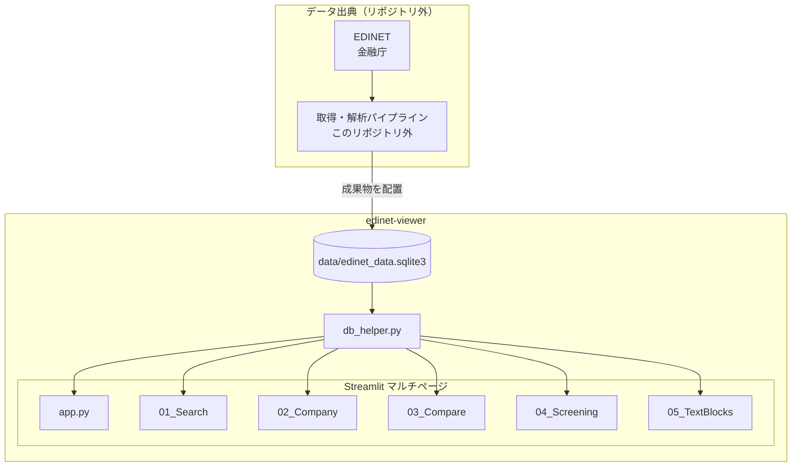

# システム構成

## 目的

EDINET由来の有価証券報告書・半期報告書等から抽出した財務指標とテキストブロックを、ローカル（またはStreamlitホスティング）で次のように利用できるようにします。

1. 企業・書類の検索と一覧確認
2. 企業単位の財務テーブル・推移チャート・テキスト閲覧
3. 複数社比較と指標スクリーニング

## 全体構成



## コンポーネント

### 1. `edinet-viewer`リポジトリ

Streamlitアプリと表示用SQLiteを管理します。日次取得やXBRL解析の実行主体ではありません。

- リポジトリ: `onokazu777/edinet-viewer`
- エントリ: `app.py`
- ページ: `pages/01_Search.py` ～ `pages/05_TextBlocks.py`
- DBアクセス: `db_helper.py`

### 2. SQLiteデータベース

- パス: `data/edinet_data.sqlite3`（リポジトリルートからの相対パス。`db_helper.DB_PATH`）
- 接続: 読み取り専用用途。`sqlite3.connect`で開き、クエリ後にクローズ
- 主要オブジェクト:
  - テーブル `documents`
  - テーブル `key_financials`
  - テーブル `text_blocks`
  - ビュー `v_key_financials`（`SELECT * FROM key_financials`）
- 任意テーブル `financials`:
  - `get_financial_details()`が参照するが、無い場合は空DataFrameを返す
  - 現行同梱DBには存在しない

統計取得では、古いスキーマ差分に備え、`parse_status` / `dl_status` / `key_financials` / `financials` / `text_blocks` の参照を try/except でフォールバックします。

### 3. Streamlitアプリ

| 画面 | ファイル | 役割 |
|---|---|---|
| ホーム | `app.py` | DB統計、書類種別グラフ、最近の提出書類、サイドバー企業クイック検索 |
| 企業検索 | `pages/01_Search.py` | 証券コード・企業名の部分一致検索、全企業一覧 |
| 企業詳細 | `pages/02_Company.py` | 主要財務、Plotlyチャート、テキスト、提出書類一覧 |
| 企業比較 | `pages/03_Compare.py` | 最大5社の最新期比較・推移・レーダーチャート |
| スクリーニング | `pages/04_Screening.py` | 最新連結期の指標条件で企業絞り込み |
| テキスト閲覧 | `pages/05_TextBlocks.py` | セクション・キーワードでのテキスト検索 |

テーマとサーバー設定は`.streamlit/config.toml`です（`headless = true`、利用統計オフ）。

### 4. 起動スクリプト

- `run.bat`: カレントをリポジトリにし、固定のPythonパスで`streamlit run app.py --server.port 8502`
- `push.bat`: `git add -A` → 固定メッセージで`commit` → `origin main`へ`push`

## 実行経路

### 閲覧（このリポジトリ）

```text
run.bat または streamlit run app.py
  → db_helper が data/edinet_data.sqlite3 を読む
  → 各ページがキャッシュ付きクエリで表示
```

### データ更新（リポジトリ外）

```text
EDINET 取得・解析（別システム）
  → edinet_data.sqlite3 を生成・更新
  → data/ へ配置（または差し替え）
  → Viewer を再起動 / キャッシュTTL経過後に反映
```

`@st.cache_data`のTTLは統計・企業一覧が3600秒、最近の提出書類が600秒です。差し替え直後に古い表示が残る場合はアプリ再起動が確実です。

## 設定値

### 環境変数・Secrets

表示アプリに必須の環境変数やStreamlit secretsはありません。

### ハードコードに近い設定

| 項目 | 場所 | 内容 |
|---|---|---|
| DBパス | `db_helper.py` | `Path(__file__).parent / "data" / "edinet_data.sqlite3"` |
| 起動ポート | `run.bat` | `8502` |
| Python実行ファイル | `run.bat` | マシン固有の絶対パス |
| pushコミットメッセージ | `push.bat` | バッチ内の固定文言 |

## 外部依存

- EDINET: データの出典（アプリはオンラインでEDINETへアクセスしない）
- Streamlit / pandas / plotly: UIと表・グラフ表示
- SQLite3: ローカルDBエンジン（Python標準）

## 依存ライブラリ

`requirements.txt`:

- streamlit>=1.30.0
- pandas>=2.1.0
- plotly>=5.18.0
